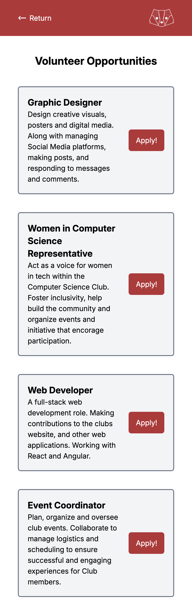
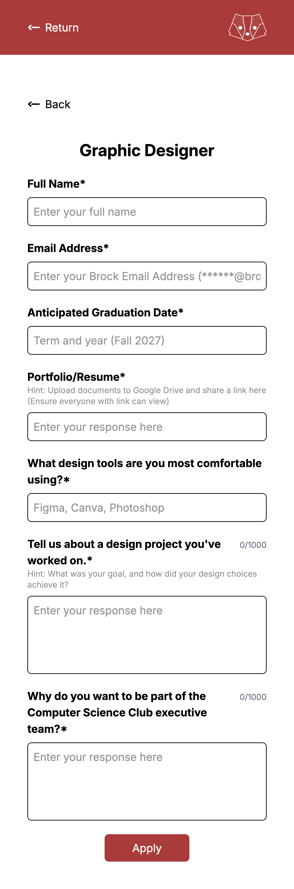
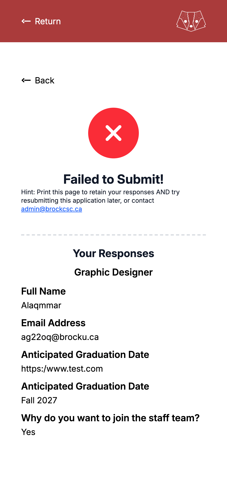

<div align="center">

# 🧑‍💻 volunteer.brockcsc.ca

**A modern volunteer recruitment portal for the Brock Computer Science Club.**

Live site: **https://volunteer.brockcsc.ca**

</div>

---

`volunteer.brockcsc.ca` is a small, focused web app that helps the Brock Computer Science Club share open volunteer roles, explain responsibilities, and collect interest from students quickly and clearly.

Think of it as a **beautiful, single‑page volunteer brochure**: visitors land on a clean, responsive page, browse roles, and immediately understand how they can get involved with the club.

> This project is built with **React Router v7**, **TypeScript**, and **Tailwind CSS**, and is designed to be deployed on modern edge/serverless platforms.

---

## ✨ Key Features

- **Clean landing page** – Hero section that welcomes visitors to volunteer with BrockCSC.
- **Role catalogue** – A structured list of roles (e.g., events, marketing, tech) with responsibilities and expectations.
- **Quick‑scan layout** – Each role is presented in a card‑like layout so visitors can skim quickly.
- **Responsive design** – Looks great on phones, tablets, and desktops.
- **SEO‑friendly** – Uses React Router `meta` for sensible titles and descriptions.
- **Fast & modern stack** – React 19 + React Router 7, TypeScript, Vite, Tailwind 4.

---

## 🖼 Visual Overview


### Home / Landing Page

- **Topbar** with the BrockCSC logo or name and navigation.
- A **hero section** introducing the volunteer initiative, with a short tagline and supporting text.
- Below the hero, a **grid of volunteer roles** grouped by area (e.g., "Events", "Technical", "Outreach").

### Application Screenshots

Here's a visual overview of the volunteer portal's key pages:

<table align="center">
  <tr>
    <td align="center" valign="top">
      <strong>Landing Page</strong><br>
      
    </td>
    <td align="center" valign="top">
      <strong>Application Form</strong><br>
      
    </td>
    <td align="center" valign="top">
      <strong>Applications Closed</strong><br>
      
    </td>
  </tr>
</table>

---

## 🏗 Project Structure

The core app lives in the `app/` directory and follows React Router v7 conventions.

```text
app/
  root.tsx          # HTML shell, meta, error boundary
  routes.ts         # Route config (index -> home route)
  routes/
	 home.tsx        # Main volunteer landing page
  Components/
	 topbar/         # Top navigation bar
	 body/           # Main content area (roles, layout)
		body.tsx
		config.ts     # Role/section configuration data
		types.ts      # Shared types for roles/config
		form/         # (Optional) forms for interest/feedback
		joblist/      # Role list & individual role components
```

High‑level responsibilities:

- `root.tsx` – Provides the HTML document shell, links, fonts, and global error boundary.
- `routes/home.tsx` – Wires the `Topbar` and `Roles` components together and defines page metadata.
- `Components/topbar` – Handles branding and top‑of‑page navigation.
- `Components/body` – Holds the main layout, role list configuration, and any forms or job cards.

---

## 🚀 Getting Started

### 1. Prerequisites

- Node.js (LTS recommended – 20+ works well)
- npm, pnpm, or yarn (examples use `npm`)

### 2. Install Dependencies

```bash
npm install
```

### 3. Run the Development Server

```bash
npm run dev
```

Then open `http://localhost:5173` in your browser.

You should see the BrockCSC volunteer page with the topbar and role listing.

---

## 📦 Scripts

All scripts are defined in `package.json`:

- `npm run dev` – Start the dev server with HMR.
- `npm run build` – Build the app for production using React Router + Vite.
- `npm run start` – Serve the built app with `@react-router/serve`.
- `npm run typecheck` – Generate React Router types and run TypeScript.
- `npm run lint` – Run ESLint and Prettier in check mode.
- `npm run lint:fix` – Auto‑fix ESLint issues and format with Prettier.

---

## 🧩 Architecture & Tech Stack

- **Framework:** React Router v7 (full‑stack mode)
- **Language:** TypeScript
- **Bundler/Dev Server:** Vite
- **Styling:** Tailwind CSS 4 + custom CSS in `app/app.css`
- **Runtime/Deployment:** Compatible with Cloudflare Workers (via `wrangler`) or Node server.

Key files:

- `react-router.config.ts` – React Router configuration and entry setup.
- `wrangler.toml` – Cloudflare Workers deployment config (if you deploy there).
- `cloudflare/src/index.ts` – Worker entrypoint glue.

---

## 🌐 Deployment

### Build

```bash
npm run build
```

This produces a `build/` directory with server and client bundles.

### Serve Locally (Production Build)

```bash
npm run start
```

### Deploying to Cloudflare Workers (Optional)

1. Install Wrangler if you haven’t:

	```bash
	npm install -g wrangler
	```

2. Configure your Cloudflare account:

	```bash
	wrangler login
	```

3. Deploy:

	```bash
	wrangler deploy
	```

Adjust settings in `wrangler.toml` as needed (routes, account id, etc.).

---

## 🧪 Development Notes

- **Meta tags:** The home route sets `title` and `description` in `routes/home.tsx` via `meta()` for better SEO.
- **Error handling:** `root.tsx` defines an `ErrorBoundary` that renders friendly error messages during runtime failures.
- **Config‑driven roles:** Role definitions are centralized under `Components/body/config.ts`, making it easy to update positions without changing layout code.

If you add new routes, define them in `app/routes/` and register them in `app/routes.ts`.

---

## 🤝 Contributing

While this project is small, contributions are welcome—especially around improving content, accessibility, and visual design.

1. Fork the repo.
2. Create a branch: `git checkout -b feature/my-enhancement`.
3. Make your changes.
4. Run `npm run lint` and `npm run typecheck`.
5. Open a pull request with a clear description and screenshots for visual changes.

---

## 📸 Adding Real Screenshots

To replace the placeholder image references in this README:

1. Run the app locally: `npm run dev`.
2. Open the site in your browser and take screenshots of:
	- The full home page (topbar + roles).
	- A close‑up of the role cards.
3. Save them under `public/screenshots/`, for example:
	- `public/screenshots/home-hero-and-roles.png`
	- `public/screenshots/home-role-cards.png`
4. Commit the images and verify they render on GitHub.

---

## 📄 License

This project is maintained by the **Brock Computer Science Club**. If you’d like to reuse or adapt this project for your own student organization, please open an issue or reach out to the maintainers.

